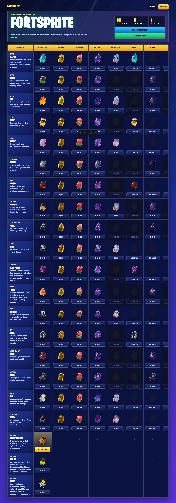
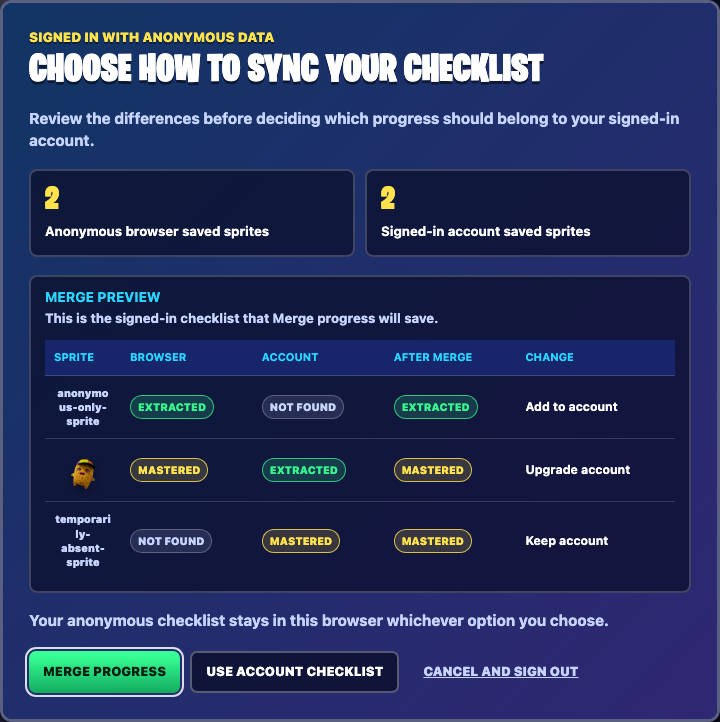
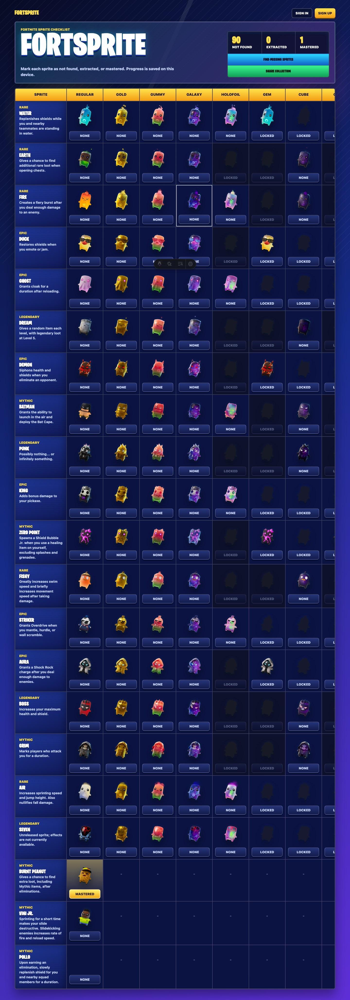

# User story: signing in with anonymous sprite progress

This visual story is generated by [`signed-in-anonymous-sync-story.spec.ts`](../../tests/browser/signed-in-anonymous-sync-story.spec.ts). Run `npm test` to refresh the screenshots.

## A player has browser-only progress

Before signing in, the player has mastered Burnt Peanut in this browser. The checklist is still anonymous and editable.

## The player reviews the sync decision

After sign-in completes, editing is blocked by the “Signed in with anonymous data” dialog. Its merge-preview table uses each affected variant’s artwork and shows browser status, saved account status, resulting merged status, and whether the merge adds, upgrades, or keeps the account entry. The player can merge, use the account checklist, or cancel and sign out.

## The player approves a merge

The merge keeps Burnt Peanut at its higher **Mastered** status, imports the browser-only sprite, keeps the account-only sprite, and writes against the revision shown in the dialog. The anonymous browser record remains unchanged.

## The player can cancel safely

If the player cancels, they are signed out without writing an account checklist. The anonymous browser checklist remains available.

